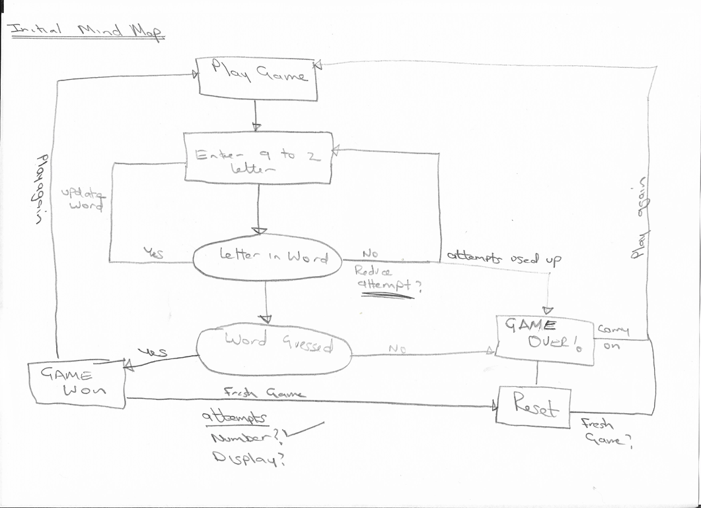
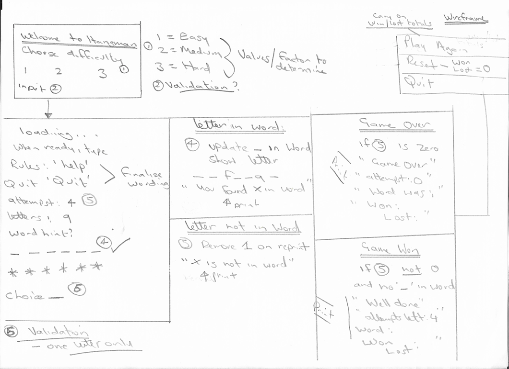
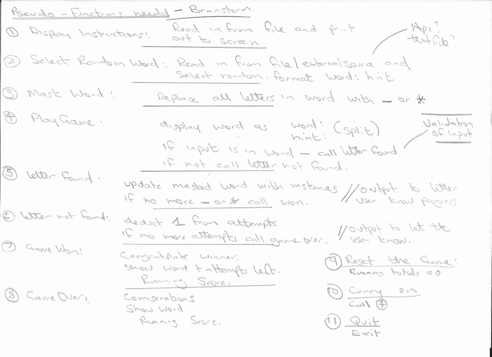

# Hangman Lite in Python.
Hangman Lite is an interactive python based game aimed to provide users of all ages with a seamless experience whilst playing hangman - extended to include a difficulty option.

The intended purpose is to provide a clean take on on the all-time class game, providing responsive feedback with the options to view the rules and quit on demand. Potential uses for the game can be for individuals (children and adults!) who want to improve their spelling or individuals wanting to improve their strategical thinking to name a few. 

## User Experience (UX)
### User Stories
The following user stories have been created identifying the needs and requirements for the game. These have further provided the foundation for the project which I have kept in mind during all aspects of development and deployment.

As a user, I want:
* To be able to work on my spelling in a fun, interactive way.
* To be able to play using a variety of words with clues!
* To have the option to select a dificulty level so it can be challenging.
* The option to see the rules when needed.
* To see feedback on the choice made (correct/incorrect) in a clear way.
* A tally to see how many words have been guessed or not.
* The option to continue, reset or quit playing.

### Mind Map: Ideas

Following on from user stories and intended purpose, an initial mind map was created to capture the logic of the game. The purpose of this was provide a high-level understanding of how the user stories could be implemented:

### Wireframe Designs
Following on from the mind map, a wireframe was created (shown below) with focus given on the user stories. This wireframe illustrates potential outputs based on the input received and types of validation to be included.

### Pseudo - functions needed (Brainstorm)
Once the UX element had been completed, I mapped out the python functions needed for the game to perform as needed:

### Process Map
The diagram below maps out the processes and the path taken evaluating the state of the game on the choices made:

## Main page

## Testing

### Bugs 

### Validation Testing

### Manual Testing

## Future Developments

## Site Production, Deployment and Contribution  

### Site production

### Deployment

### Contribution

## Technologies and tools Used
### Languages used

### Frameworks, Libraries and Programs Used

## Credits
### Content

### General

  
## Overall Credit

## Personal Summary
