# Hangman Lite in Python.
Hangman Lite is an interactive python based game aimed to provide users of all ages with a seamless experience whilst playing hangman - extended to include a difficulty option.

The intended purpose is to provide a clean take on the all-time class game, providing responsive feedback with the options to view the rules and quit on demand. Potential uses for the game can be for individuals (children and adults!) who want to improve their spelling or individuals wanting to improve their strategical thinking to name a few. 

## User Experience (UX)
### User Stories
The following user stories have been created identifying the needs and requirements for the game. These have further provided the foundation for the project which I have kept in mind during all aspects of development and deployment.

As a user, I want:
* To be able to work on my spelling in a fun, interactive way.
* To be able to play using a variety of words with clues!
* To have the option to select a difficulty level so it can be challenging.
* The option to see the rules when needed.
* To see feedback on the choice made (correct/incorrect) in a clear way.
* A tally to see how many words have been guessed or not.
* The option to continue, reset or quit playing.

### Mind Map: Ideas

Following on from user stories and intended purpose, an initial mind map was created to capture the logic of the game. The purpose of this was provide a high-level understanding of how the user stories could be implemented:

### Wireframe Designs
Following on from the mind map, a wireframe was created (shown below) with focus given on the user stories. This wireframe illustrates potential outputs based on the input received and types of validation to be included.

### UX View

Following on from the wireframe design, a final UX view of the game was designed. As the game is purely command line, the views illustrate the outputs dependant on state of the game:

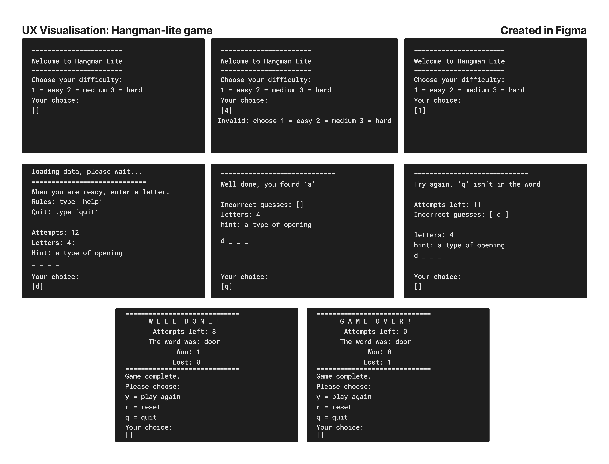

Having finalised the UX element completed provided a clear picture of the finished product. It has also provided me with a clear reference guide for the wording format and spacing to be used to ensure a positive user experience. 

### Pseudo - functions needed (Brainstorm)
Once the UX element had been completed, I mapped out the python functions needed for the game to perform as needed:

### Process Map
The diagram below maps out the processes and the path taken evaluating the state of the game on the inputs made:

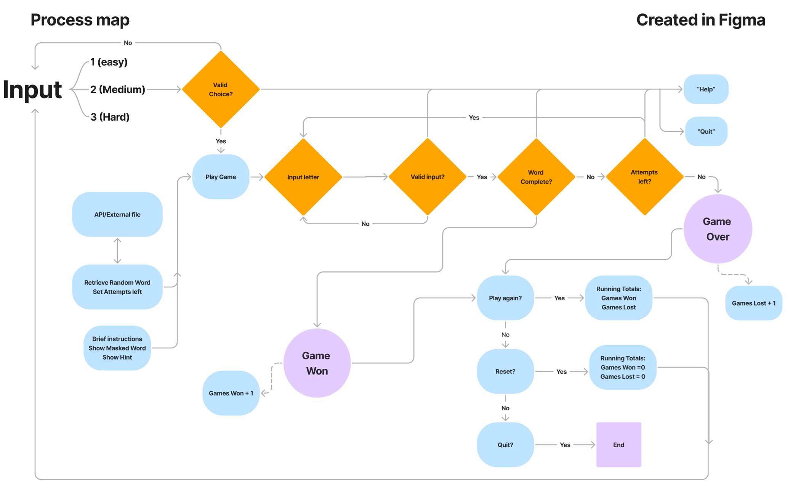

## Main page

### Features

The main page presents the player(user) with a python console in which the game is ran. The player is welcomed and invited to make a selection on their difficulty level:

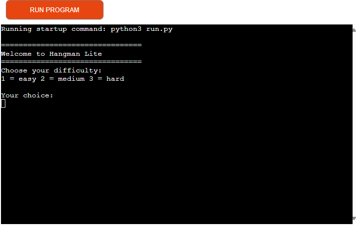

**Please note:** For the purposes of this project, the following values have used to determine the difficulty:

1 = easy (12 attempts)

2 = medium (8 attempts)

3 = hard (4 attempts)

If an invalid input is recieved, the player is notfied of this and prompted to try again:

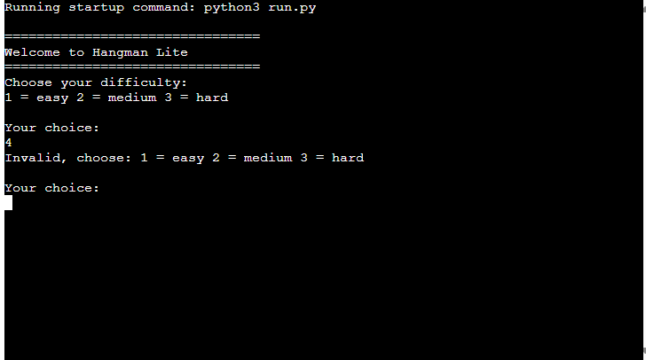

Once a valid input has been recieved, the game begins. The player is presented with a word to guess that has been randomly selected along with a hint to guess the word. In addition to this, the player is also made aware of the number of attempts they have to guess the word:

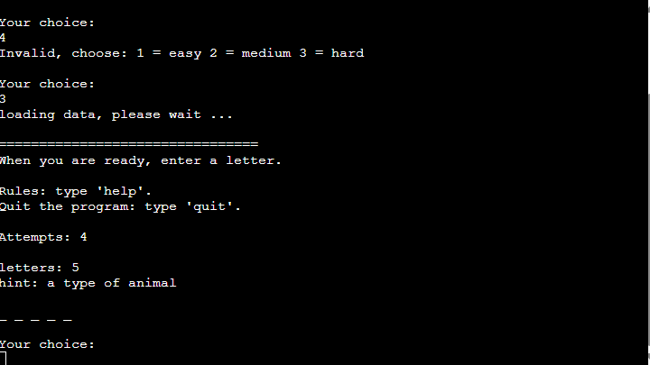

The player also has the option to view rules on demand at any point of the game:

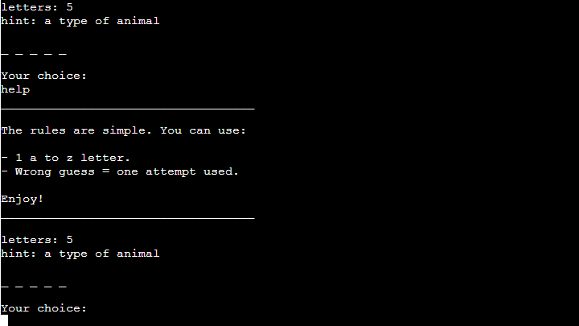

There is also the option to quit which terminates the game:

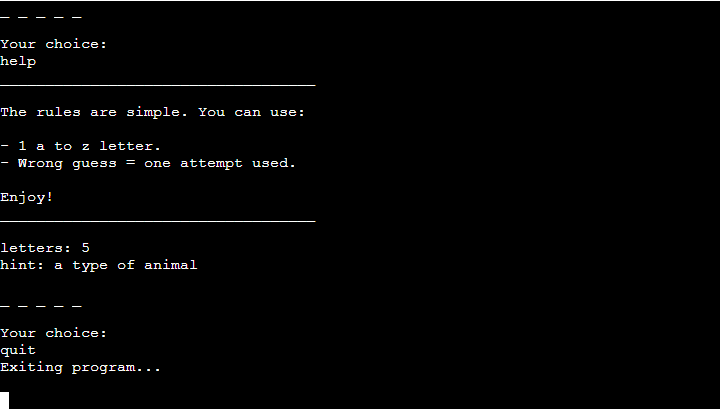

**Please note:** on quiting, the "Run program" button would need to be clicked to start the game again.

If the input matches a letter within the word, the user is notfied and the word is updated to show all instances of this matched letter:

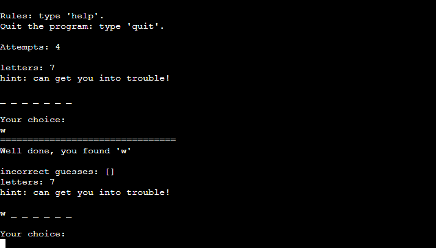

Should the input not match a letter within the word, an attempt is used up. The incorrect inputs are recorded and displayed back to the player in a convenient way along with the updated attempts left:

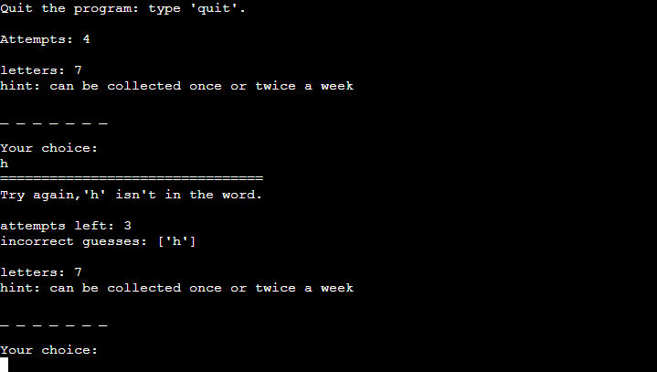

Once a word has been completely guessed, the player is congratulated on their win along with a summary of the game:

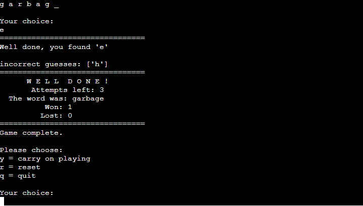

If the attempts are all used up, the game is deemed over. The player is commiserated and again a summary of the game given:

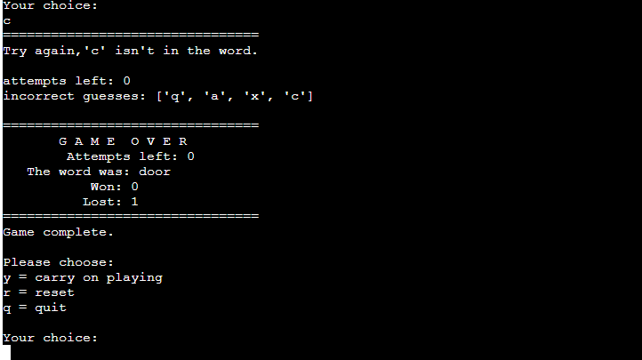

Irrespective of a winning or losing, the player has the option to carry on playing, resetting or quitting.

The option to carry on playing will load a new game with a running total of the games won or lost incrementing respectively:

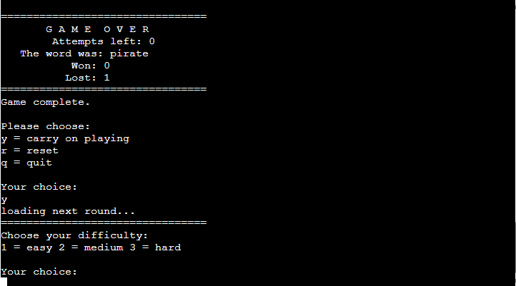

The option to reset will restart the game and the running totals for win/lost reset. The player is advised of the reset and presented the initial difficulty menu:

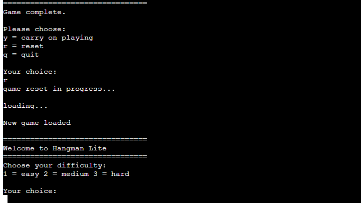

The option to quit will terminate the program as documented above.

These inputs again are validated to only recieve the correct specified input. If this is incorrect, the player will be prompted to try again:

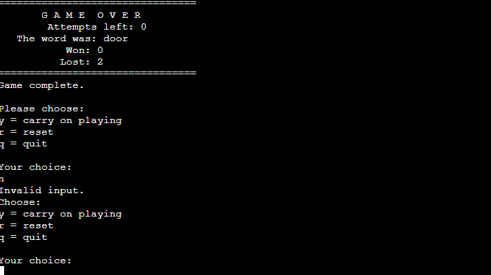

## Testing

### Bugs 
* **Issue 1 (ID 7ae0beb):** The player was able to input upper and lower case letters. This in turn meant that an upper case letter was not the same as a lower case letter therefore being classed as an incorrect guess. For example, 'T' wouldn't be the same as 't'.

    * **Fix (ID 23b2c0f):** This was fixed by formatting the input recieved and the random word selected using the .lower() built in function. Once implemented, a re-test found no further issues. 

* **Issue 2 (ID 5bf8a81):** The games won/lost running total was not updating on the "play again" selection at the end of a game and were resetting every game.

    * **Fix (ID 276bc43):** This was fixed by globalising the variables won and lost. Once implemented, a re-test found no further issues. 

### Validation Testing

### Manual Testing

The following manual testing was carried out to confirm if the game performed as required and results matched the expected output.

| Test  | Test Step/Action                    |Input Type         |Expected                      |Result                                                        | Result|
| :----:|:------------------------------------|:-----------------:|:-----------------------------------------------------------------------|:-----------------------------------------------|:--------:| 
| 1     |Enter invalid difficulty             |int/string/symbol  |Error, asked to try again                                               |Invalid input identified. Try again             |Pass      | 
| 2     |Enter valid difficulty               |1, 2, 3            |Start game                                                              |Game started                                    |Pass      |
| 3     |Enter number                         |int                |Validate and inform incorrect input                                     |Input validated correctly - asked to try again  |Pass      |
| 4     |Enter space                          |space              |validate and inform incorrect input                                     |Input validated correctly - asked to try again  |Pass      |
| 5     |More than one letter                 |string             |validate and inform incorrect input                                     |Input validated correctly - asked to try again  |Pass      |
| 6     |letter found                         |string             |update letter(s) in word                                                |Word updated                                    |Pass      |
| 7     |letter not in word                   |string             |reduce attempt, record letter used                                      |attempt reduced, letter recorded                |Pass      |
| 8     |word guessed                         |string             |increment won score, summary of game, option to play again, reset, quit |Input validated correctly - asked to try again  |Pass      |
| 9     |word not guessed/attempts finished   |string             |increment lost score, summary of game, option to play again, reset, quit|Input validated correctly - asked to try again  |Pass      |
| 10    |play again                           |string: "y"        |load new game, running totals for won/lost                              |new game loaded, totals kept                    |Pass      |
| 11    |reset game                           |string: "r"        |load new game, reset won/lost totals                                    |new game loaded, totals reset                   |Pass      |
| 12    |quit game (at end or during)         |string: "q"/ "quit"|terminate the game                                                      |game terminated                                 |Pass      |
| 13    |enter "help"                         |string: "help"     |show the rules on demand                                                |rules shown whenever typed                      |Pass      |

### Future Developments

There are two potential future developments for this project.

1. Expand the difficulty level - generate the complexity of the word/clue based on the difficulty selected.
2. A scores table showing the top wins with the least attempts used.

## Site Production, Deployment and Contribution  

### Site production

The site was created using Gitpod’s VS Code workspace environment with all the relevant files and folder structures created within. To deploy to GitHub, the following commands were carried out in the command line terminal to commit and push the changes to the GitHub repository: 

1 `git add .`- (Staging the changes in the current working tree ready to be committed).

2 `git commit -m 'Meaningful commit message"` - (The working tree is prepared with an upload message).

3 `git push` - (changes are pushed out up to the GitHub repository).

The words and clues for the game have been imported using an API for google sheets. This was implemented  using the CI sandwiches project tutorial and is referenced in the "Frameworks, Libraries and Programs Used" below.

### Deployment

The live link to the site can be found here: [Hangman Lite](https://hangman-lite-2cf8212eb558.herokuapp.com/)

### Contribution

I welcome any contributions/recommendations/changes to the project. To do this, the github repository would need to be forked from github and downloaded locally so it can be worked on. 

Github has provided step by step instructions on how to do this [here.](https://docs.github.com/en/get-started/exploring-projects-on-github/contributing-to-a-project#forking-a-repository)

## Technologies and tools Used
### Languages used
 * Python   
### Frameworks, Libraries and Programs Used

* The following librarys were used:
    * import random
    * import sys
    * import gspread
     from google.oauth2.service_account import Credentials

* The following requirements were defined in the requirements.txt file for API conection to google sheets (also needed for deployment):

    * cachetools==5.5.0
    * google-auth==2.35.0
    * google-auth-oauthlib==1.2.1
    * gspread==6.1.4
    * oauthlib==3.2.2
    * pyasn1==0.6.1
    * pyasn1_modules==0.4.1
    * requests-oauthlib==2.0.0
    * rsa==4.9

* Google sheets: 

    * Google sheets has been used to store the words used in the game and have been imported in using the API. 

     
## Credits
### Content

### General

  
## Overall Credit

## Personal Summary
